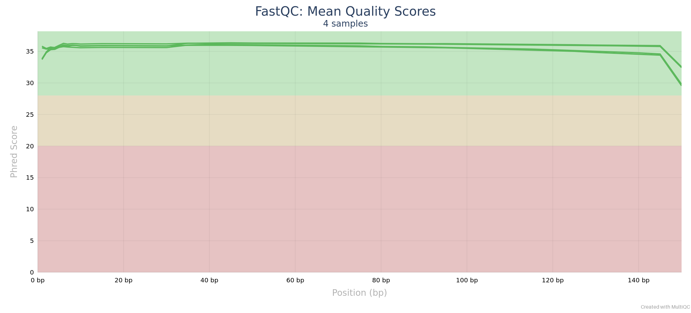
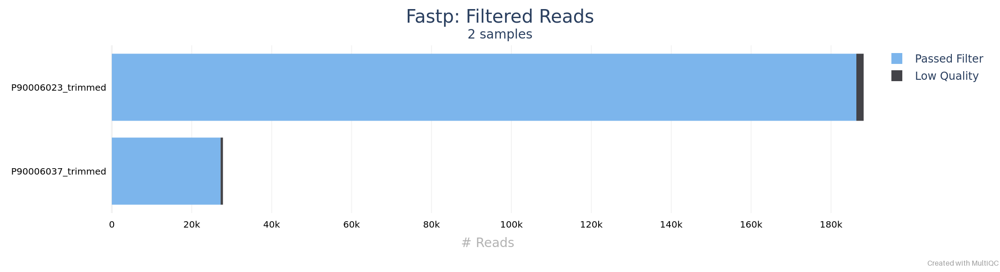
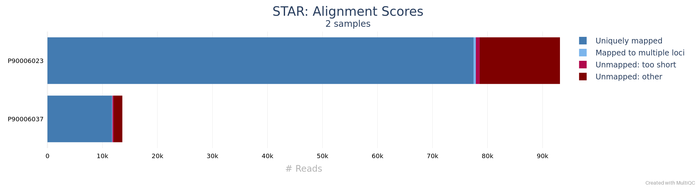
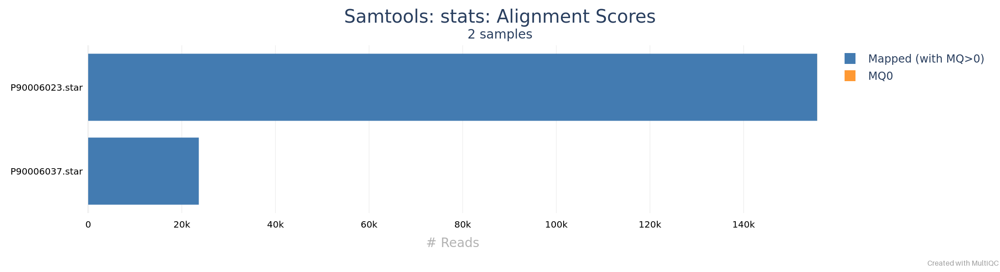

# stjudecab/rsvrecon: Output

## Introduction

This document provides detailed information on the outputs generated by the `stjudecab/rsvrecon` Nextflow pipeline.
Results will be stored in the directory specified during pipeline execution with the parameter: `--outdir <OUTDIR>`.

After the pipeline execution finishes, the output directory (`<OUTDIR>`) will contain several organized subdirectories,
described below. All paths mentioned here are relative to the top-level output directory.

This pipeline, built with [Nextflow](https://www.nextflow.io/), processes sequencing data through multiple analysis
stages, summarized as follows:

- [Read Quality Control (QC)](#reads-quality-control-qc)
  - [FastQC](#fastqc) - FastQC QC
  - [FastP](#fastp) - FastP trimming and QC
- [Identify matched genome from RSV databases](#identify-matched-genome-from-rsv-database)
  - [KMA](#kma) - KMA mapping against RSV database
- [Read Alignment](#read-alignment)
  - Aligner
    - [BWA](#bwa) - BWA Aligner (default)
    - [STAR](#star) - STAR Aligner
  - [Samtools](#samtools) - Sort, index and generate metrics for alignments
- [Reference guide read assembly](#reference-guide-read-assembly)
  - [IGVTools](#igvtools) - Count the coverage across the genome.
  - [Custom genome assembly](#customized-assembly-script) - Genome assembly with customized scripts.
- [Variant Calling](#variant-calling)
  - [NextClade](#nextclade) - Clade assignment, mutation calling and sequence quality checks
- [Genotyping](#genotyping)
  - [BLAST](#blast) - Blast to reference assembly
  - [MAFFT](#mafft) - Multiple sequence alignment between query and reference virus subtype
  - [FastTree](#fasttree) - Generate the phylogenetic tree
- [Pipeline information](#pipeline-information) - Report metrics generated during the execution

## Output directory Structure

```
<OUTDIR>/<sample_id>
├── assembly
├── bam
├── fastq
├── genotyping
├── GISAID
├── log
├── phylogeny_tree
├── qc
├── reference
└── variant_calling
```

## Reads quality control (QC)

### FastQC

<details markdown="1">
<summary>Output files</summary>

- `<sample_id>/qc/fastqc/`
  - `pre_trim` and `post_trim`
    - `*_fastqc.html`: FastQC report containing quality metrics.
    - `*_fastqc.zip`: Zip archive containing the FastQC report, tab-delimited data file and plot images.

</details>

[FastQC](http://www.bioinformatics.babraham.ac.uk/projects/fastqc/) gives general quality metrics about your sequenced reads.
It provides information about the quality score distribution across your reads, per base sequence content (%A/T/G/C),
adapter contamination and overrepresented sequences. For further reading and documentation see the [FastQC help pages](http://www.bioinformatics.babraham.ac.uk/projects/fastqc/Help/).



### FastP

<details markdown="1">
<summary>Output files</summary>

- `<sample_id>/fastq/trimmed_fastp`
  - `*.fastp.fastq.gz`: Trimmed and filtered reads file in FastQ format.
- `<sample_id>/qc/fastp/`
  - `*.fastp.html`: Trimming report in html format.
  - `*.fastp.json`: Trimming report in json format.
- `<sample_id>/log/fastp`
  - `*.fastp.log`: Trimming log file.

</details>

[fastp](https://github.com/OpenGene/fastp) is a tool designed to provide fast, all-in-one preprocessing for FastQ files.
It has been developed in C++ with multithreading support to achieve higher performance. Fastp is used in this pipeline
for standard adapter trimming and quality filtering.



## Identify matched genome from RSV database

### KMA

<details markdown="1">
<summary>Output files</summary>

- `<sample_id>/reference/kma`
  - `stat/*.res`: The KMA mapping summary.
  - `*.fasta`: The best batched genome in `FASTA` format for `<sample_id>` in RSV database.
  - `*.gff`: The best matched genome in `GFF` format for `<sample_id>` in RSV database.

</details>

[KMA](https://github.com/genomicepidemiology/kma) is a mapping method designed to map raw reads directly against redundant databases,
in an ultra-fast manner using seed and extend. KMA is particularly good at aligning high quality reads against highly redundant databases,
where unique matches often does not exist. It works for long low quality reads as well, such as those from Nanopore.
Non-unique matches are resolved using the "ConClave" sorting scheme, and a consensus sequence are output in addition to
other common attributes, based on our users demands.

## Read Alignment

Adapter-trimmed reads are mapped to the reference assembly using the aligner set by the `--aligner` parameter.
Available aligners are [BWA](https://bio-bwa.sourceforge.net/bwa.shtml)(default) and [STAR](https://github.com/alexdobin/STAR).

### BWA

[BWA](https://bio-bwa.sourceforge.net/bwa.shtml) is a software package for mapping DNA sequences against a large reference genome,
such as the human genome.

### STAR

[STAR](https://github.com/alexdobin/STAR) (Spliced Transcripts Alignment to a Reference) is a highly efficient sequence aligner designed for RNA-seq data.
It aligns reads to a reference genome using a fast seed-search algorithm followed by stitching of local alignments, allowing accurate detection of splice junctions.
STAR supports both single-end and paired-end reads and is optimized for speed and accuracy.

<details markdown="1">
<summary>Output files</summary>

- `<sample_id>/log/star`
  - `*.Log.final.out`: STAR mapping log file.

</details>



### SAMtools

<details markdown="1">
<summary>Output files</summary>

- `<sample_id>/bam`
  - `*.sorted.bam`: Coordinate sorted BAM file containing read alignment information.
  - `*.sorted.bam.bai`: Index file for coordinate sorted BAM file.
- `<sample_id>/qc/samtools/star`
  - `*.star.{stats,flagstat,idxstats}`: Read mapping statistics generated by [SAMtools](http://samtools.sourceforge.net/).

</details>

The BAM file generated in STAR alignment are further processed by [SAMtools](http://samtools.sourceforge.net/) to
sort them by coordinate, for indexing, as well as to generate read mapping statistics.



## Reference-guide read assembly

### IGVTools

<details markdown="1">
<summary>Output files</summary>

- `<sample_id>/assembly/coverage`
  - `*.coverage.wig`: Average feature density across the genome.

</details>

[IGVTools](https://igv.org/doc/desktop/) provides a number of utilities to preprocess data files. `IGVTools Count`
computes average feature density over a specified window size across the genome. Common usages include computing
coverage for alignment files and counting hits in Chip-seq experiments. By default, the resulting file will be
displayed as a bar chart when loaded into IGV.

### Customized assembly script

<details markdown="1">
<summary>Output files</summary>

- `<sample_id>/assembly/fasta`
  - `*.consensus.fasta`: Assembled consensus genome fasta file.

</details>

[Customized assembly script](https://github.com/stjudecab/rsvrecon/blob/dev/bin/assemble_sequence.py) is used to
processes `IGV WIG` files, which contain nucleotide coverage information, to generate a consensus sequence aligned
with a provided reference genome. It reads base-level coverage data, applies a user-defined cutoff to determine
confident base calls, and constructs the resulting consensus sequence. The output is saved as a FASTA file, facilitating
downstream genomic analyses and workflows.

## Variant Calling

### NextClade

<details markdown="1">
<summary>Output files</summary>

- `<sample_id>/variant_calling/nextclade`
  - `*.csv`: Analysis results from `NextClade` containing genome clade assignment, mutation calling and sequence quality checks.
- `<sample_id>/reference`
  - `*.nextclade.db`: The reference `Nextclade` database used by `<sample_id>`.

</details>

[NextClade](https://github.com/nextstrain/nextclade) performs viral genome clade assignment, mutation calling and
sequence quality checks for the consensus sequences generated in this pipeline. Similar to Pangolin, it has been used
extensively during the COVID-19 pandemic. A [web application](https://clades.nextstrain.org/) also exists that allows
users to upload genome sequences via a web browser.

## Genotyping

### BLAST

<details markdown="1">
<summary>Output files</summary>

- `<sample_id>/genotyping/<wholegenome/ggene>/blastn`
  - `*.txt`: BLAST results against the target virus.
- `<sample_id>/GISAID/blastn`
  - `*.txt`: BLAST results against the [GISAID](https://gisaid.org/) virus database.

</details>

[blastn](https://blast.ncbi.nlm.nih.gov/Blast.cgi?PAGE_TYPE=BlastSearch) is used to align the assembled contigs against
the virus reference genome.

### MAFFT

<details markdown="1">
<summary>Output files</summary>

- `<sample_id>/phylogeny_tree/<wholegenome/ggene>/mafft`
  - `*.fas`: Full alignment, containing both reference virus and query sequences.

</details>

[MAFFT](https://mafft.cbrc.jp/alignment/software/) is a multiple sequence alignment program for unix-like operating systems.

### FastTree

<details markdown="1">
<summary>Output files</summary>

- `<sample_id>/phylogeny_tree/<wholegenome/ggene>/fasttree`
  - `*.fasttree_phylogeny.tre`: Produces a [Newick](https://phylipweb.github.io/phylip/newicktree.html) format phylogeny from a multiple sequence alignment.

</details>

[FastTree](https://morgannprice.github.io/fasttree/) infers approximately-maximum-likelihood phylogenetic trees from
alignments of nucleotide or protein sequences. FastTree can handle alignments with up to a million of sequences in a
reasonable amount of time and memory.

## Pipeline information

<details markdown="1">
<summary>Output files</summary>

- `pipeline_info/`
  - Reports generated by Nextflow: `execution_report_<timestamp>.html`, `execution_timeline_<timestamp>.html`, `execution_trace_<timestamp>.txt`, `pipeline_dag_<timestamp>.dot`/`pipeline_dag_<timestamp>.svg` and `manifest_<timestamp>.bco.json`.
  - Reports generated by the pipeline: `pipeline_report.html`, `pipeline_report.txt` and `software_versions.yml`. The `pipeline_report*` files will only be present if the `--email` / `--email_on_fail` parameters are used when running the pipeline.
  - Parameters used by the pipeline run: `params_<timestamp>.json`.

</details>

[Nextflow](https://www.nextflow.io/docs/latest/tracing.html) provides excellent functionality for generating various reports
relevant to the running and execution of the pipeline. This will allow you to troubleshoot errors with the running of the pipeline,
and also provide you with other information such as launch commands, run times and resource usage.
